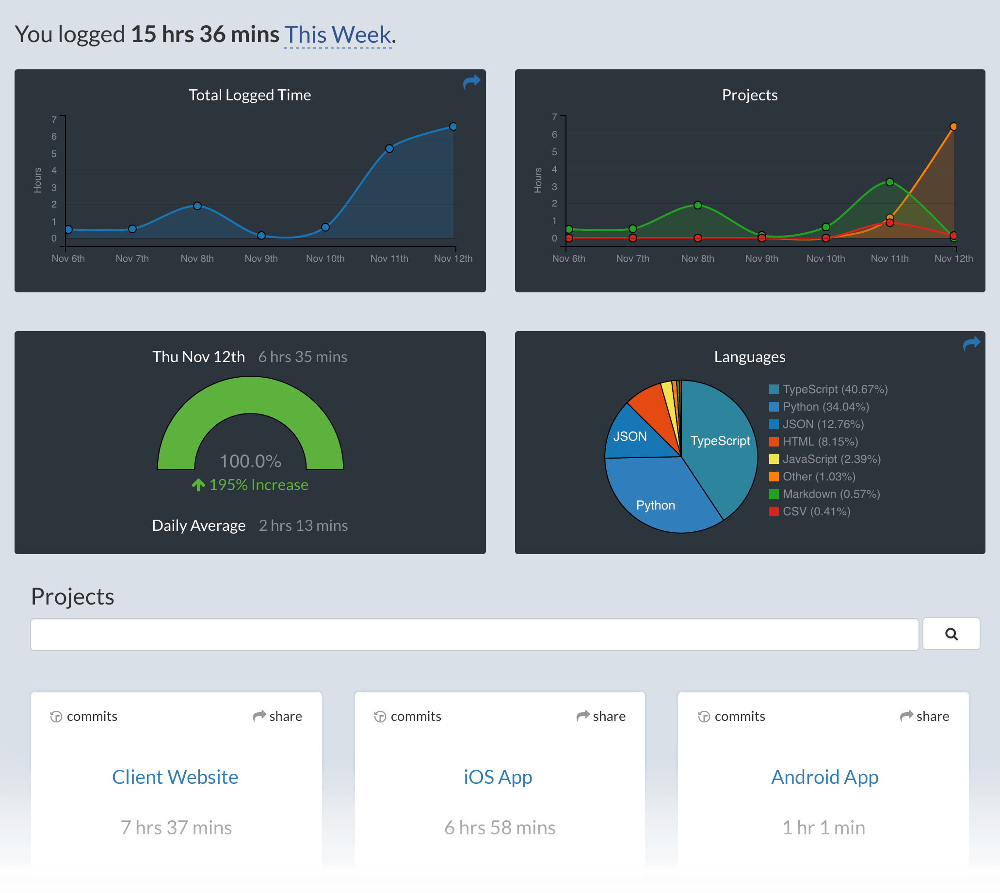

# WakaTime for Visual Studio Code

[WakaTime][wakatime] is an open source VS Code plugin for metrics, insights, and time tracking automatically generated from your programming activity.

## Installation

1. Press `F1` or `⌘ + Shift + P` and type `install`. Pick `Extensions: Install Extension`.

    
2. Type `wakatime` and hit `enter`.

    

3. Enter your [api key][api key], then press `enter`.

    > (If you’re not prompted, press `F1` or `⌘ + Shift + P` then type `WakaTime API Key`.)

4. Use VSCode and your coding activity will be displayed on your [WakaTime dashboard](https://wakatime.com)

## Usage

Visit [https://wakatime.com](https://wakatime.com) to see your coding activity.

## Configuring

VS Code specific settings are available from `⌘ + Shift + P`, then typing `wakatime`.

For example, to hide today's coding activity in your status bar:

Press `⌘ + Shift + P` then set `WakaTime: Status Bar Coding Activity` to `false`.

Extension settings are stored in the INI file at `$WAKATIME_HOME/.wakatime.cfg`.

More information can be found from [wakatime-cli][wakatime-cli configs].

If using an online IDE like [gitpods](https://gitpod.io/), add your [api key][api key] to global ENV key `WAKATIME_API_KEY`.

Notes:

1. `$WAKATIME_HOME` defaults to `$HOME`
1. To disable the extension at startup add `disabled=true` to your config, this operation can also be performed by pressing `⌘ + Shift + P` and selecting `WakaTime: Disable`.

## Troubleshooting

First, turn on debug mode:

1. Press `F1` or `⌘ + Shift + P`
2. Type `> WakaTime: Debug`, and press `Enter`.
3. Select `true`, then press `Enter`.

Next, open your Developer Console to view logs and errors:

`Help → Toggle Developer Tools`

Errors outside the scope of vscode-wakatime go to `$WAKATIME_HOME/.wakatime.log` from [wakatime-cli][wakatime-cli help].

The [How to Debug Plugins][how to debug] guide shows how to check when coding activity was last received from your editor using the [Plugins Status Page][plugins status page].

**Microsoft Windows Only:** Using WakaTime behind a corporate proxy? Try enabling your Windows Root Certs inside VS Code with the [win-ca][winca] extension:
Press `Ctrl + Shift + X`, search for `win-ca`, press `Install`.

For more general troubleshooting info, see the [wakatime-cli Troubleshooting Section][wakatime-cli help].

[wakatime]: https://wakatime.com/vs-code
[api key]: https://wakatime.com/api-key
[wakatime-cli help]: https://github.com/wakatime/wakatime-cli/blob/develop/TROUBLESHOOTING.md
[wakatime-cli configs]: https://github.com/wakatime/wakatime-cli/blob/develop/USAGE.md
[how to debug]: https://wakatime.com/faq#debug-plugins
[plugins status page]: https://wakatime.com/plugin-status
[winca]: https://github.com/ukoloff/win-ca/tree/master/vscode
